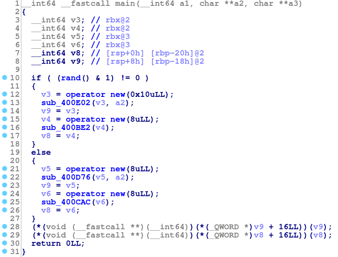
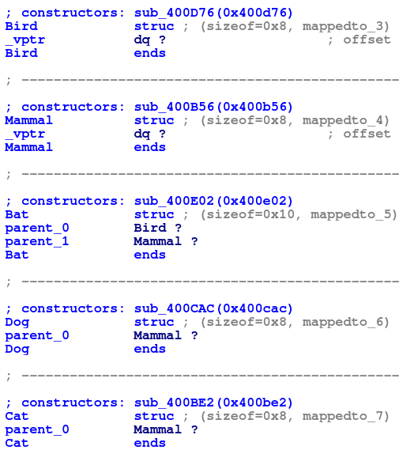
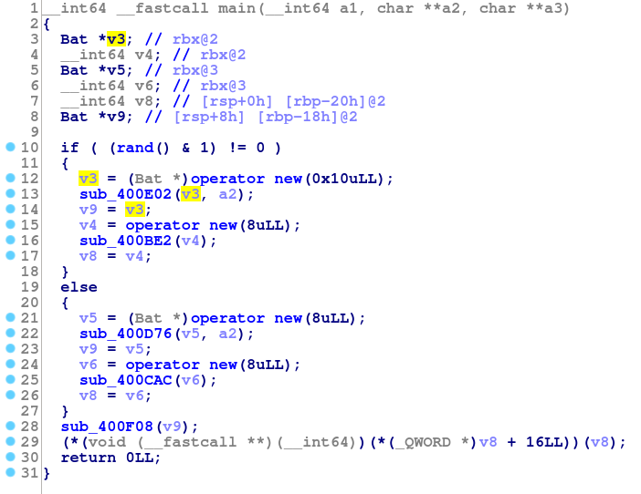
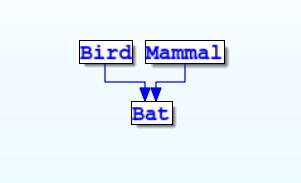

The basics
===========

``Devirtualize`` is an IDA plugin that rebuilds type information from the vtables
and RTTI embedded in a binary. This information can then be used to 'devirtualize'
virtual function calls. Some additional features are provided like viewing
inheritance graphs.

Requirements
------------

``devirtualize`` was written using IDA Pro 6.95. It may work with earlier versions
but has not been tested. Additionally, the plugin makes use of the IDA Decompiler
features, so the user must have a license for that.

Installation
------------

Because the project is built using the IDA python interface, there is no need for
compilation. Just copy the ``devirtualize`` folder and ``devirtualize_main.py``
file into your ida ``plugins`` directory.

Usage
-----

Most features of the plugin will require that the user has first run the vtable
analysis. To do this go to ``Edit->Plugins->Devirtualize``. This process may
take several minutes. After the analysis is completed, structures for each recovered type will be
present in the ``Structures`` window in IDA.

The actual devirtualization will occur automatically. When you have set the
type of a local variable, the plugin will devirtualize anything it is able to
using that information.

For example, suppose you have the following type hierarchy:

.. code-block:: c++
   
   struct Mammal {
     Mammal() { std::cout << "Mammal::Mammal\n"; }
     virtual ~Mammal() {}
     virtual void walk() { std::cout << "Mammal::walk\n"; }
   };
   
   struct Cat : Mammal {
     Cat() { std::cout << "Cat::Cat\n"; }
     virtual ~Cat() {}
     virtual void walk() { std::cout << "Cat::walk\n"; }
   };
   
   struct Dog : Mammal {
     Dog() { std::cout << "Dog::Dog\n"; }
     virtual ~Dog() {}
     virtual void walk() { std::cout << "Dog::walk\n"; }
   };
   
   struct Bird {
     Bird() { std::cout << "Bird::Bird\n"; }
     virtual ~Bird() {}
     virtual void fly() { std::cout << "Bird::fly\n"; }
   };

   // This may not be taxonomically accurate
   struct Bat : Bird, Mammal {
     Bat() { std::cout << "Bat::Bat\n"; }
     virtual ~Bat() {}
     virtual void fly() { std::cout << "Bat::fly\n"; }
   };

And a ``main`` that looks like:

.. code-block:: c++
   :linenos:

   int main() {
     Bird *b;
     Mammal* m;
     if (rand() % 2) {
       b = new Bat();
       m = new Cat();
     } else {
       b = new Bird();
       m = new Dog();
     }
     b->fly();
     m->walk();
   }

Obviously the calls to ``fly`` and ``walk`` on lines 11 and 12 are virtual
function calls. Which function is actually called depends on the output of
``rand``. Here's how IDA might show ``main``:

Here the virtual function calls are visible on lines 28 and 29. If we run
``devirtualize``, we can look at the ``Structures`` window to see what
the plugin has been able to recover.

So ``devirtualize`` has correctly recovered the heirarchy, as well as the
names using RTTI (if RTTI was disabled, the plugin will generate default
names). Going back to the decompiled ``main`` output, we notice that lines
13, 16, 22, and 25 contain constructor calls (in future versions, ``devirtualize``
may rename the constructor to make this easier to see). If we then set
a variable to one of these types, we can see the devirtualization. For example
if we mark ``v3`` as a ``Bat*``:

Notice that the virtual call on line 28 has been replaced with a normal function
call. This function can be renamed, changed types, etc. It is as though a normal
function call was actually there in source.

Viewing the Inheritance Graph
-----------------------------

If the user right clicks on ``v3`` after setting its type to ``Bat*``, an additional
option "Open Ancestor Type Graph" will be available that will show an inheritance
graph:

